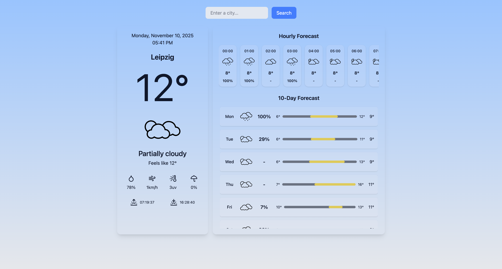

# Weather App v3

A modern weather forecast app built with React and Vite. Instantly get current, hourly, and daily weather information for any city.

--

## Features

-   Search weather by city
-   Current conditions (temperature, humidity, wind, uv, sunrise/sunset)
-   Hourly forecast (next 24 hours)
-   Daily forecast (up to 10 days and scrollable)
-   Dynamic background based on weather
-   Fast and lighweight (powered by Vite)

--

## Demo

[live Demo](...)

--

## Contributing

Pull request are welcome!

--

## Credits

-   [Visual Crossing Weather API](https://www.visualcrossing.com/weather-api)
-   [React](https://react.dev)
-   [Vite](https://vitejs.dev)
-   [Lucide Icons](https://lucide.dev)
-   [Tailwind CSS](https://tailwindcss.com)

--

## Contact

Made with love by [rizalamar](https://github.com/rizalamar)
